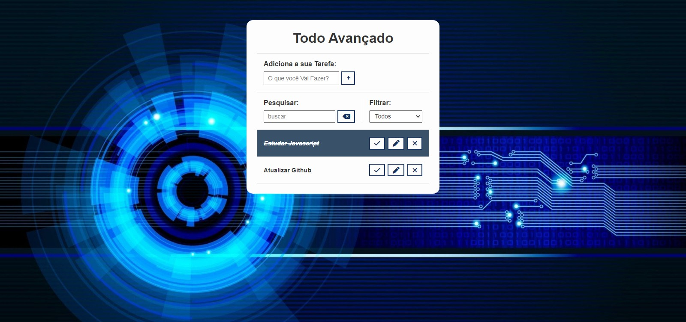

<h1 align="center"> DevLinks </h1>

Programa gratuito, apresentado como aula no canal Hora de Codar de Matheus Battisti no Youtube.  

  <a href="#-tecnologias">Tecnologias</a>&nbsp;&nbsp;&nbsp;|&nbsp;&nbsp;&nbsp;
  <a href="#-projeto">Projeto</a>&nbsp;&nbsp;&nbsp;|&nbsp;&nbsp;&nbsp;
  <a href="#-layout">Layout</a>&nbsp;&nbsp;&nbsp;|&nbsp;&nbsp;&nbsp;
  <a href="#memo-licença">Licença</a>

 

  

## 🚀 Tecnologias

Esse projeto foi desenvolvido com as seguintes tecnologias:

- HTML e CSS
- JavaScript
- Git e Github

## 💻 Projeto

O ToDo Versão 2 é uma agenda de tarefas atualizado e com mais recuros.
Utilizei para estudos de Javascript, CSS e HTML, bem como Local Storage e DOM.
Possui opções de Marcar como Feito, Alterar e Deletar uma Tarefa.

## 🔖 Layout

Você pode visualizar o layout do projeto acessando o canal Hora de Codar de Matheus Battisti no YouTube

## 📝 Licença

Esse projeto é livre e está disponível no Youtube no Canal de Matheus Battisti.

----
Feito com ♥ by Wellington Sato 🚀  